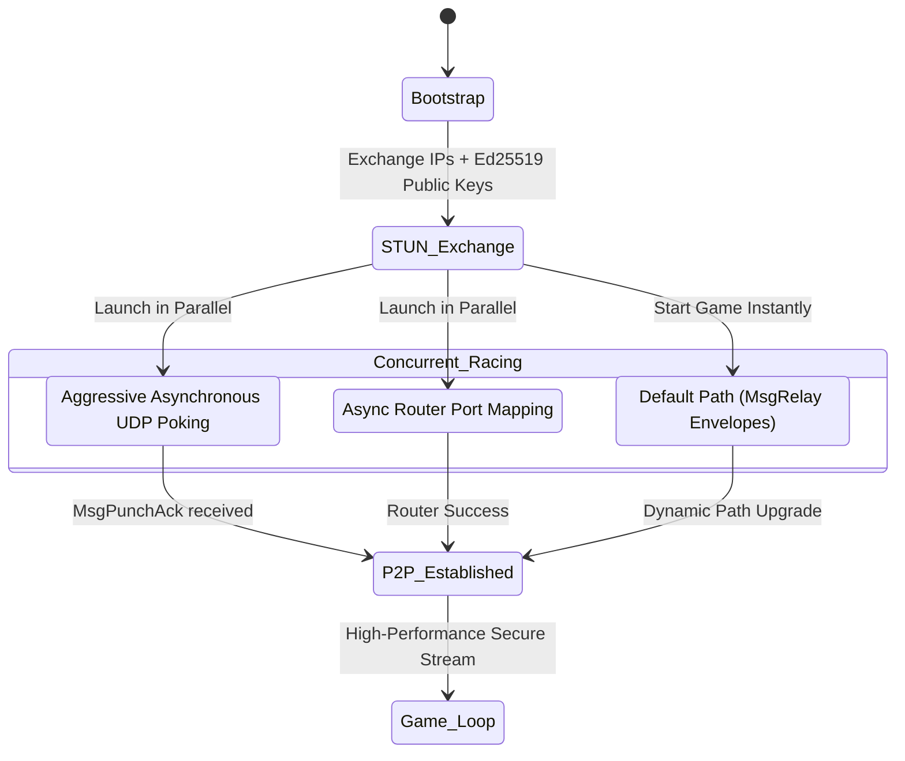
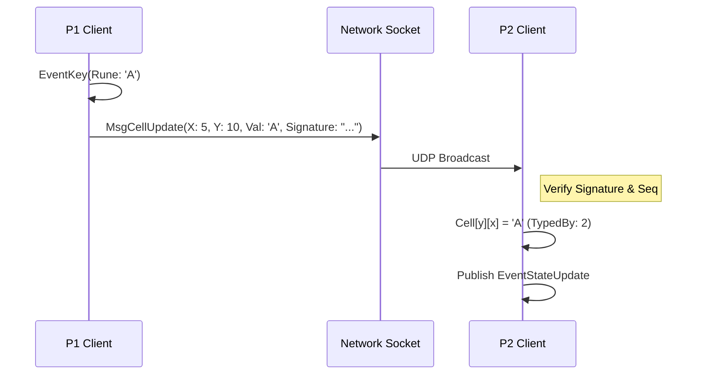

# CrossTerm Architecture Reference

This document outlines the internal engine design and the zero-trust, high-performance networking stack that powers CrossTerm's real-time cooperative and competitive modes.

## 1. Engine & Concurrency Model

CrossTerm runs on an asynchronous, **Event-Driven Architecture** built on top of a central `EventBus`. The game avoids monolithic, synchronous loops. Instead, distinct isolated "Systems" operate in parallel goroutines, reacting exclusively to published events.

### The Component Systems
* **Engine Core (`GameState` & `EventBus`)**: Holds the deterministic data layer (cursor position, grid, completion timers). It acts as the single source of truth.
* **Input System**: Blocks on terminal input events (`tcell.EventKey`), parses raw keystrokes, mutates the `GameState`, and aggressively publishes `EventStateUpdate` or `EventCursorMove` to the bus.
* **Render System**: Subscribes to state updates. Completely decoupled from input logic, it reads the deterministic `GameState` and paints the terminal UI via `tcell` at its own cadence.
* **Puzzle System**: Validates player intent (e.g., checking answers against the solution grid, managing anagram tools, advancing clues).
* **Network System**: The largest subsystem; processes out-of-band UDP socket data strings, translates remote operations to local `GameState` mutations, and broadcasts local intent over the internet.

---

## 2. P2P Hybrid Networking Stack (Racing Architecture)

CrossTerm employs a **Zero-Config Hybrid UDP Stack**. It uses a single Oracle Cloud server as an identity-exchange relay, but prioritizes direct peer-to-peer performance.

### Diagram: Network State Machine



---

## 3. The Zero-Trust Handshake Flow

When a host starts a multiplayer game, CrossTerm spins up a background UDP listener socket.

1. **Host `CREATE_ROOM`**: The Host sends a `MsgCreateRoom` payload to the Relay Server, including its ephemeral **Ed25519 Public Key**.
2. **Joiner `JOIN_ROOM`**: The Joiner connects with its own public key.
3. **Identity Swap**: The Relay server identifies the connection and sends a `MsgPeerInfo` containing each player's public `IP:Port` **and the opponent's Public Key** down to both clients.
4. **SAME_LAN Interception**: The Relay checks if both clients share the *exact same public IP*. If true, they are behind the same NAT. Direct UDP hole-punching via public IP is disabled to avoid loopback deadlocks, and the system relies on the Relay for initial sync while attempting UPnP in the background.

---

## 4. Multi-Path Concurrent Racing

CrossTerm no longer waits for a "successful" handshake. It follows a **"Relay-First, P2P-Fastest"** philosophy. 

### Path 1: Instant Relay Fallback
The moment `MsgPeerInfo` is received, the Game Board launches. All traffic is wrapped in `MsgRelay` envelopes. This ensures a 100% connect success rate even on the most restrictive enterprise firewalls.

### Path 2: Aggressive Asynchronous Punching
In the background, a concurrent `punchLoop` fires `MsgPunch` packets every 500ms. If a client receives a `MsgPunchAck` from the direct peer address, the `NetworkSystem` atomically flips the connection state. The `sendMessage` function instantly pivots to writing raw UDP packets to the peer's socket, bypassing the relay server without the user ever noticing.

### Path 3: Asynchronous UPnP Discovery
A `setupUPnP` routine runs in a background goroutine during the "Room ID" selection. It attempts to map the local UDP port on the home router using UPnP/NAT-PMP. If successful, it provides a "clean" path for the peer to connect without needing hole-punching.

---

## 5. Security: Ed25519 & Replay Protection

Because UDP is origin-spoofable, CrossTerm implements a cryptographically secure Zero-Trust model.

1. **Packet Signing**: Every `NetworkMessage` is stamped with a `Sequence` number and signed using the player's `PrivateKey`.
2. **Signature Verification**: The receiver recalculates the signature using the peer's `PublicKey` (exchanged via the Relay). 
3. **Rogue Detection**: Any packet with an invalid signature is silently dropped by the `readLoop`.
4. **Sliding Sequence Window**: UDP packets sent over WANs (especially cross-platform) frequently arrive out of order. Instead of strictly dropping any packet older than the last received sequence (which would break multi-chunk puzzle transfers), CrossTerm allows a sliding window of `100` sequence slots. Only severely old sequences are dropped as Replay Attacks.

---

## 6. UDP MTU Limits & Double-Base64 Fragmentation

Once connections are established, the Host must send the massive serialized puzzle binary to the Joiner. 

UDP packets are fragile. Sending a 10kb JSON payload over standard internet infrastructure will result in automatic fragmentation or complete drops by ISP routers due to the Maximum Transmission Unit (MTU) limit (typically 1500 bytes per frame).

To resolve this, CrossTerm sequentially chunks the puzzle array into bytes. To prevent cross-continent MTU fragmentation, CrossTerm's chunk size is strictly clamped to `512 bytes`, keeping the final doubly-inflated envelope (after Base64 encoding) safely hovering around 900 bytes per datagram.

```go
// Inside internal/systems/network/system.go
chunkSize := 512
total := (len(data) + chunkSize - 1) / chunkSize

for i := 0; i < total; i++ {
    start := i * chunkSize
    end := start + chunkSize
    if end > len(data) { end = len(data) }

    msg := netproto.NetworkMessage{
        Type:        netproto.MsgPuzTransfer,
        Payload:     data[start:end],
        ChunkIndex:  &ci,
        TotalChunks: &tc,
    }
    s.sendMessage(msg)
    time.Sleep(50 * time.Millisecond) // Critical jitter to prevent UDP buffer bloat
}
```

---

## 7. Realtime Game Synchronization

With the socket pinned open via a 15-second recursive ping (`MsgKeepalive`), gameplay begins. 
CrossTerm does **not** constantly serialize and mail the whole board. It relies on deterministic state. It merely synchronizes cursor intent and signed keyboard strokes.



---

## 8. P2P Forensic Diagnostics

CrossTerm includes robust, production-grade network observability directly in its `debug.log`. This acts as a "black box" flight recorder for the P2P connection lifecycle:
* **Hole-Punch Visibility**: Tracks every `MsgPunch` attempt and logs exactly which IP/Port the peers appear from.
* **NAT Rebinding Detection**: Alerts when a `MsgPunchAck` arrives from an unexpected port, diagnosing Symmetric NAT interference.
* **Path Tracing**: Every `sendMessage()` call logs whether it routed via `DIRECT P2P` or the `RELAY`, providing an exact timestamp for when the background P2P upgrade succeeds.
* **Cryptographic Auditing**: Logs detailed sequence numbers and failure types for any rejected rogue packets.

---

## 9. Storage & Progress Observability

CrossTerm ensures clean zero-footprint local environments. It utilizes native OS structures for writing downloaded puzzles and tracking game saves.

* **Windows:** `%AppData%\Roaming\crossterm`
* **macOS / Linux:** `~/.crossterm/`

Both aggregators and the local `crossterm` runtime utilize the `internal/paths` module to construct absolute URIs, ensuring binary drops work natively across independent folder structures.

### Puzzle Progress Tracking
CrossTerm features real-time puzzle completion observability in its TUI explorer. The `savesystem` calculates the completion percentage dynamically by checking the `data/saves/` directory. It uses the `SaveData` struct to persist not just the grid, but also the `GameMode` and `SubMode` the puzzle was last played in. This allows the file explorer to render rich progress badging (e.g., `[███░░░] (Solo Timed)`) directly next to local `.puz` files.
