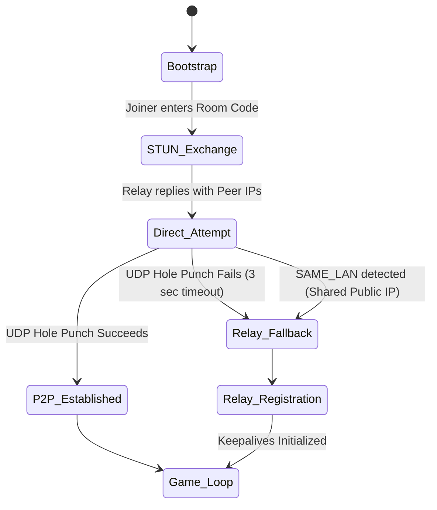
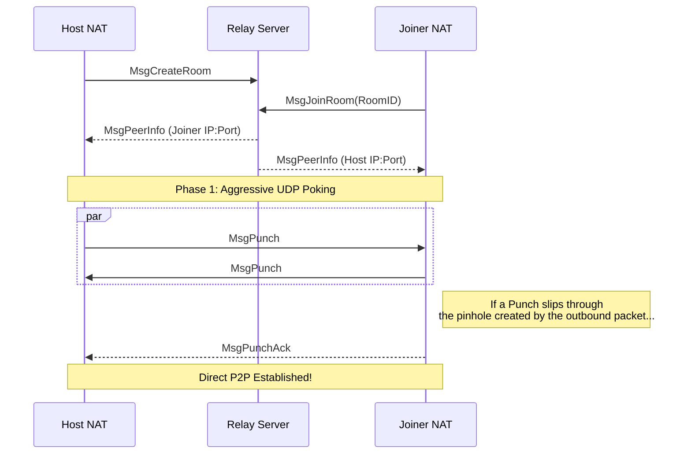
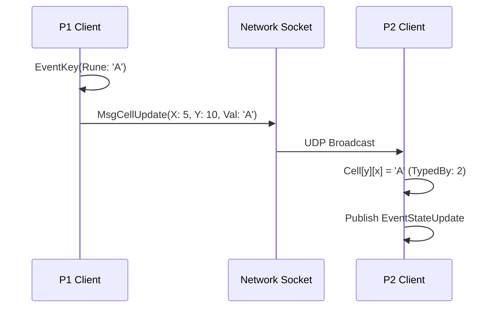

# CrossTerm Architecture Reference 🏗️

This document outlines the internal engine design and the peer-to-peer (P2P) networking stack that powers CrossTerm's real-time cooperative and competitive modes. 

## 1. Engine & Concurrency Model

CrossTerm runs on an asynchronous, **Event-Driven Architecture** built on top of a central `EventBus`. The game avoids monolithic, synchronous loops. Instead, distinct isolated "Systems" operate in parallel goroutines, reacting exclusively to published events.

### The Component Systems
* **Engine Core (`GameState` & `EventBus`)**: Holds the deterministic data layer (cursor position, grid, completion timers). It acts as the single source of truth.
* **Input System**: Blocks on terminal input events (`tcell.EventKey`), parses raw keystrokes, mutates the `GameState`, and aggressively publishes `EventStateUpdate` or `EventCursorMove` to the bus.
* **Render System**: Subscribes to state updates. Completely decoupled from input logic, it reads the deterministic `GameState` and paints the terminal UI via `tcell` at its own cadence.
* **Puzzle System**: Validates player intent (e.g., checking answers against the solution grid, managing anagram tools, advancing clues).
* **Network System**: The largest subsystem; processes out-of-band UDP socket data strings, translates remote operations to local `GameState` mutations, and broadcasts local intent over the internet.

---

## 2. P2P Hybrid Networking Stack (The Magic)

CrossTerm employs a **Zero-Config Hybrid UDP Stack**. It uses a single Oracle Cloud server as both a STUN (Session Traversal Utilities for NAT) discovery service and a TURN-style routing relay.

### Diagram: Network State Machine



---

## 3. The Discovery & Handshake Flow

When a host starts a multiplayer game, CrossTerm spins up a background UDP listener socket.

1. **Host `CREATE_ROOM`**: The Host sends a `MsgCreateRoom` payload to the Relay Server. The Relay logs the Host's public IP and assigning a unique 4-character hex ID (e.g., `a7b2`).
2. **Joiner `JOIN_ROOM`**: The Joiner connects to the Relay Server issuing a `MsgJoinRoom` with the room code. 
3. **STUN Reflection**: The Relay server identifies the connection, acts as a STUN server, and sends a `MsgPeerInfo` containing each player's public `IP:Port` down to both clients.
4. **SAME_LAN Interception**: The Relay checks if both clients share the *exact same public IP*. If true, they are behind the same NAT (e.g., a shared Wi-Fi hotspot). Direct UDP hole-punching via public IP causes half-open deadlocks over NAT loopbacks, so the Relay issues a `MsgSameLAN` forcing both peers to instantly pivot to Relay Mode.

---

## 4. UDP Hole Punching vs. Relay Fallback

CrossTerm prioritizes latency. Once public IPs are discovered, both clients launch a concurrent 3-second aggressive UDP barrage (`MsgPunch`). 

### UDP Hole Punching Sequence


### The TURN-style Relay Solution
If the strict NAT topology of either user drops the `MsgPunch` packets, CrossTerm gives up after 3 seconds and falls back to **Relay Mode**.

Instead of writing data directly to the peer's socket, the local system takes its standard `NetworkMessage` and stuffs it inside a `MsgRelay` envelope.

```go
// Inside internal/systems/network/system.go
if s.peerAddr != nil {
    // Direct P2P Mode! No middleman overhead.
    s.conn.WriteToUDP(bMsg, s.peerAddr)
} else if s.relayAddr != nil {
    // Rely Mode: Wrap it and ship it to Oracle Cloud
    wrap := netproto.NetworkMessage{
        Type:     netproto.MsgRelay,
        RoomID:   s.roomID,
        PlayerID: &s.playerID, 
        Payload:  bMsg,
    }
    bWrap, _ := json.Marshal(wrap)
    s.conn.WriteToUDP(bWrap, s.relayAddr)
}
```

#### NAT Port Rebinding & PlayerID Routing
When routing over the relay, the relay typically identifies a sender via strict `sender_ip:sender_port` packet headers. However, intensive consumer NATs will often unexpectedly *rebind* a UDP connection to a new outbound port.

If the port rebinds, the relay drops the packet because it thinks a rogue agent is hijacking the session. CrossTerm solves this with graceful degradation: the envelope includes a `PlayerID` (1 for Host, 2 for Joiner). If strict IP:Port matching fails, the Relay Server falls back to inspecting the `PlayerID` and blindly mapping the new socket origin to that player, automatically healing the connection loop seamlessly.

---

## 5. UDP MTU Limits & Double-Base64 Fragmentation

Once connections are established, the Host must send the massive serialized puzzle binary (containing grids, clues, and metadata) to the Joiner. 

UDP packets are fragile. Sending a 10kb JSON payload over standard internet infrastructure will result in automatic fragmentation or complete drops by ISP routers due to the Maximum Transmission Unit (MTU) limit (typically 1500 bytes per frame).

To resolve this, CrossTerm sequentially chunks the puzzle array into bytes. However, due to `[]byte` JSON Marshaling rules, byte arrays are serialized as `Base64` strings (adding a 33% size inflation). In Relay Mode, the chunk is Base64'd once, shoved into the `.Payload` of the Relay envelope, and Base64'd a *second time*. 

To prevent cross-continent MTU fragmentation, CrossTerm's chunk size is strictly clamped to `512 bytes`, keeping the final doubly-inflated envelope safely hovering around 900 bytes per datagram.

```go
// Chunking sequence for huge puzzle arrays
chunkSize := 512
total := (len(data) + chunkSize - 1) / chunkSize

for i := 0; i < total; i++ {
    start := i * chunkSize
    end := start + chunkSize
    if end > len(data) { end = len(data) }

    msg := netproto.NetworkMessage{
        Type:        netproto.MsgPuzTransfer,
        Payload:     data[start:end],
        ChunkIndex:  &ci,
        TotalChunks: &tc,
    }
    s.sendMessage(msg)
    time.Sleep(50 * time.Millisecond) // Critical jitter to prevent UDP buffer bloat
}
```

---

## 6. Realtime Game Synchronization

With the socket pinned open via a 15-second recursive ping (`MsgKeepalive`), gameplay begins. 
CrossTerm does **not** constantly serialize and mail the whole board. It relies on deterministic state. It merely synchronizes cursor intent and keyboard strokes.



A collision hierarchy dictates that if two players input on the same cell simultaneously, UDP race conditions dictate the last packet to cross the internet layer writes the final state.

---

## 7. Storage Hierarchy & AppData Pathing

CrossTerm ensures clean zero-footprint local environments. It utilizes native OS structures for writing downloaded puzzles and tracking game saves relative to the specific user partition rather than relying on `./data` subdirectories.

* **Windows:** `%AppData%\Roaming\crossterm`
* **macOS / Linux:** `~/.crossterm/`

Both aggregators and the local `crossterm` runtime utilize the `internal/paths` module to construct absolute URIs, auto-generating dependencies and ensuring binary drops work natively across independent folder structures.
