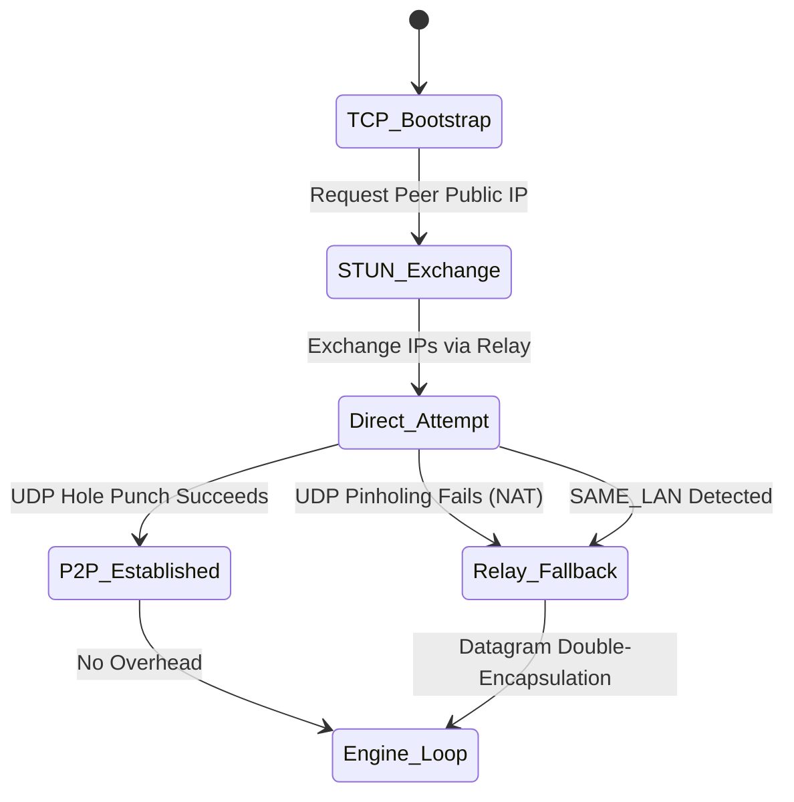

# CrossTerm: The Ultimate Terminal Cryptic Crossword Engine

<p align="center">
  <em>A blazingly fast, highly competitive, and deeply cooperative cryptic crossword engine built natively for the terminal.</em>
</p>

---

**CrossTerm** is a modern, event-driven TUI (Terminal User Interface) game designed for crossword enthusiasts who want a distraction-free, zero-latency solving experience.

Whether you are enjoying a casual Sunday crossword with assistive tools, competing head-to-head in a blind speedrunning duel, or solving collaboratively over the internet with zero network setup, CrossTerm delivers a premium solving experience straight to your command line.

## Core Features

- **Universal `.puz` Support:** Natively parses and renders standard Across Lite binary files.
- **Pluggable Aggregators:** Out-of-the-box support for modular Python aggregator scripts. Fetch daily puzzles from custom web sources directly from the main menu without leaving your terminal!
- **Robust Multiplayer:** Play instantly over the internet. Zero port-forwarding required. CrossTerm utilizes custom UDP Hole-Punching and a global NAT Relay Server to ensure you can always connect to your friends.
- **Cross-Platform Persistence:** Auto-saves your progress to native AppData directories (`~/.crossterm` / `%AppData%`) across Mac, Windows, and Linux. You'll never lose your spot.
- **Immersive Rendering:** Highlights active clues with dynamic contextual coloring (Yellow for Across, Purple for Down).
- **Anagram Workbench:** A dedicated, grid-locked anagramming tool that floats right over the board for solving complex cryptic anagrams.

---

## ⚙️ Architecture & P2P Networking

CrossTerm is capable of achieving extremely low-latency connections with zero user configuration by dynamically adjusting its network traversal strategies based on real-time internet topological checks. 



> **For an extensive, deep-dive into the custom-built networking stack, STUN/TURN fallbacks, and the MTU byte-limit constraints we had to dodge, check out the [Technical Architecture Documentation](ARCHITECTURE.md)!**

---

## 🎮 Game Modes

### Single Player

1. **Solo Standard (Untimed)**
   - The classic, relaxing crossword experience.
   - **Full access** to all assistive tools (Check Word, Reveal Letter, etc.).
   - No timer, no pressure.
2. **Solo Timed**
   - A competitive speedrun mode for personal bests.
   - **No assistive tools allowed.** You must rely entirely on your own skills.
   - Features manual submission verification. Mistakes cost time!

### Multiplayer (P2P Over Internet)

1. **Collab Mode**
   - Real-time cooperative puzzle solving.
   - See your partner's cursor live on the board.
   - See who typed what with distinct player colors (Cyan vs Magenta).
   - Live stat tracking: see who is carrying the team!
2. **Blind Duel**
   - The ultimate competitive crossword experience.
   - You and your opponent play on the same board, but **you cannot see their edits**.
   - Race to submit the final board first.
   - Every incorrect submission incurs a brutal **+10 second time penalty**!

---

## Controls & Keybindings

CrossTerm features universal keybindings designed to avoid conflicts with terminal multiplexers (like tmux). Modifier keys automatically map to `Option (⌥)` on Mac and `Alt` on Linux/Windows.

_(Note: The `^` symbol represents `Ctrl` or `Alt` depending on your OS)._

### Basic Navigation

| Key             | Action                                                      |
| --------------- | ----------------------------------------------------------- |
| `Arrow Keys`    | Move cursor horizontally/vertically                         |
| `Mouse Click`   | Jump cursor to clicked cell                                 |
| `Enter` / `Tab` | Toggle cursor direction (Across ↔ Down)                     |
| `Space`         | Clear current cell                                          |
| `Backspace`     | Delete current cell and step backward                       |
| `PgUp` / `PgDn` | Chronological Clue Traversal (Jump to previous/next number) |

### Game Menus & Tools

| Key          | Action                                                                                                              |
| ------------ | ------------------------------------------------------------------------------------------------------------------- |
| `ESC` / `^Q` | Pause Game / Return to Menu (Safely Auto-Saves)                                                                     |
| `^C`         | **Show All Clues (Clue Explorer):** Opens a massive, scrollable (Trackpad/Mouse-Wheel supported) list of all clues. |
| `^G`         | **Go-To Clue:** Quick-jump intercept. (e.g., hit `^G`, type `14`, hit `Enter` to instantly jump to 14-Across).      |
| `^S`         | **Submit Board:** Manually submit your current board for verification against the solution (Timed/Duel modes only). |

### Assistive Suite _(Solo Standard Only)_

| Key  | Action                                                                                                        |
| ---- | ------------------------------------------------------------------------------------------------------------- |
| `^W` | **Check Word:** Highlights incorrect letters in the current active word in Red, and correct letters in Green. |
| `^E` | **Check All:** Verifies every filled square on the entire grid.                                               |
| `^T` | **Reveal Word:** Surrenders and instantly fills in the correct solution for the current highlight.            |
| `^Y` | **Reveal All:** Surrenders the entire grid.                                                                   |

### Anagram Workbench

To use the Anagram Workbench, hover over any word and press `^A`. The word will pop out into a floating sandbox.

| Key          | Action                                                                                      |
| ------------ | ------------------------------------------------------------------------------------------- |
| `Arrow Keys` | Move cursor along the anagram letters                                                       |
| `L`          | **Lock/Unlock**: Pin a letter in place (turns Red).                                         |
| `Space`      | **Shuffle**: Randomly shuffle all _unlocked_ letters!                                       |
| `Enter`      | **Commit**: Push the rearranged anagram directly down onto the game grid and exit the tool. |
| `ESC`        | Exit the Anagram Workbench without saving changes.                                          |

---

## Installation & Running

CrossTerm requires **Go 1.25+** to compile.

1. **Clone the repository:**

   ```bash
   git clone https://github.com/xARSENICx/CrossTerm.git
   cd CrossTerm
   ```

2. **Build the Engine:**

   ```bash
   # This will automatically download all dependencies and build the binary via the unified Makefile
   make build
   ```

3. **Play:**
   ```bash
   ./bin/crossterm
   ```

**Enjoy the ultimate terminal solving experience!**
